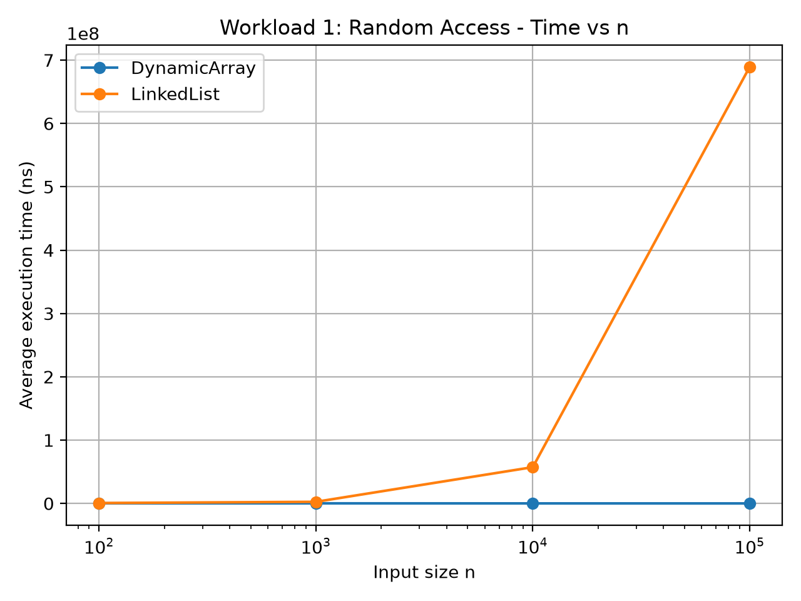
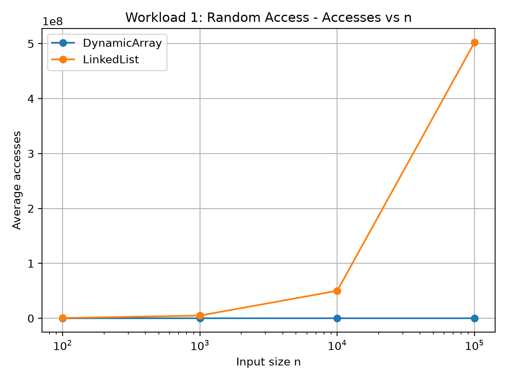
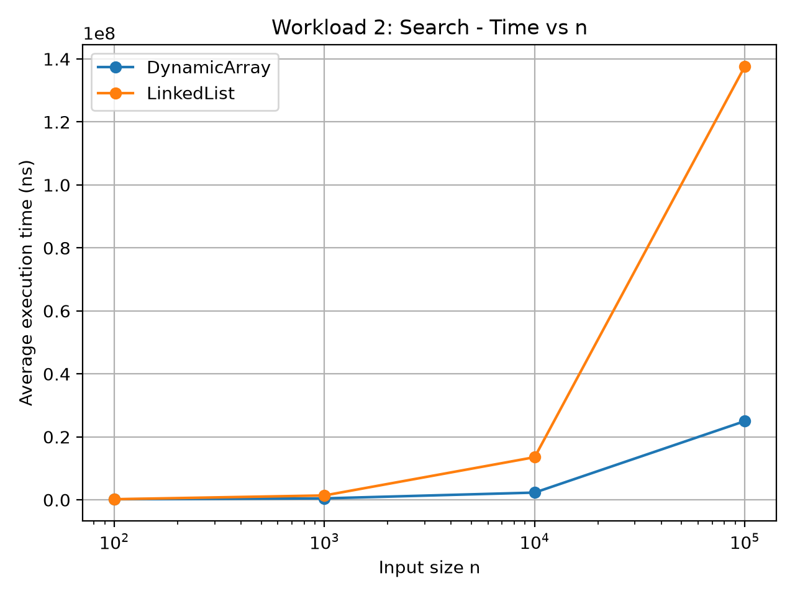
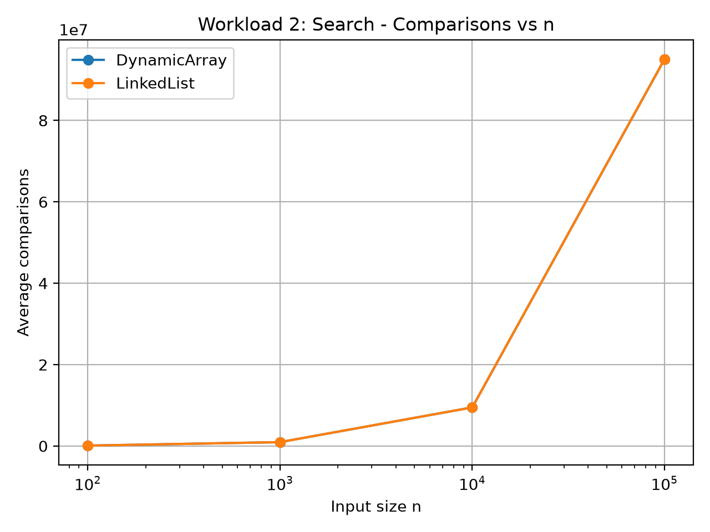
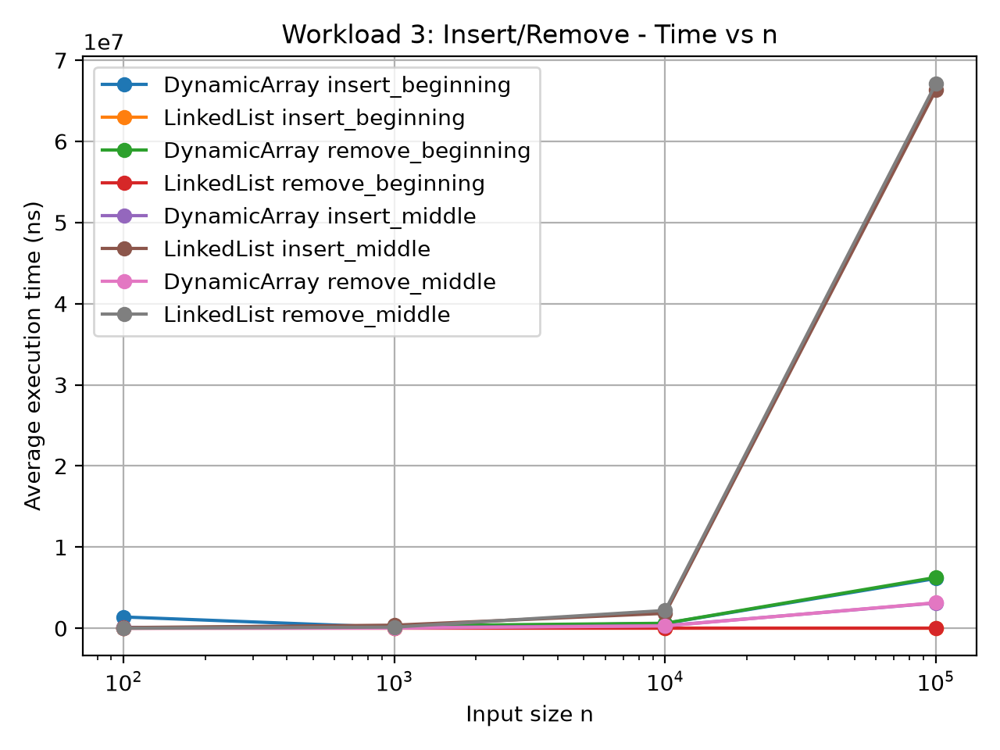
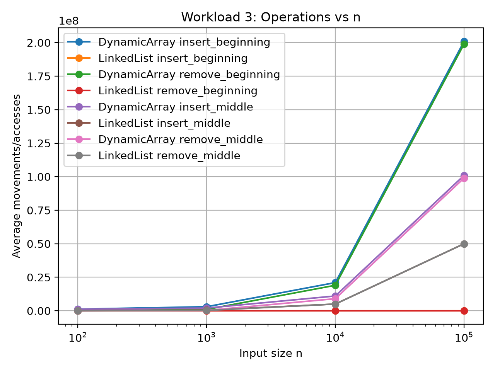
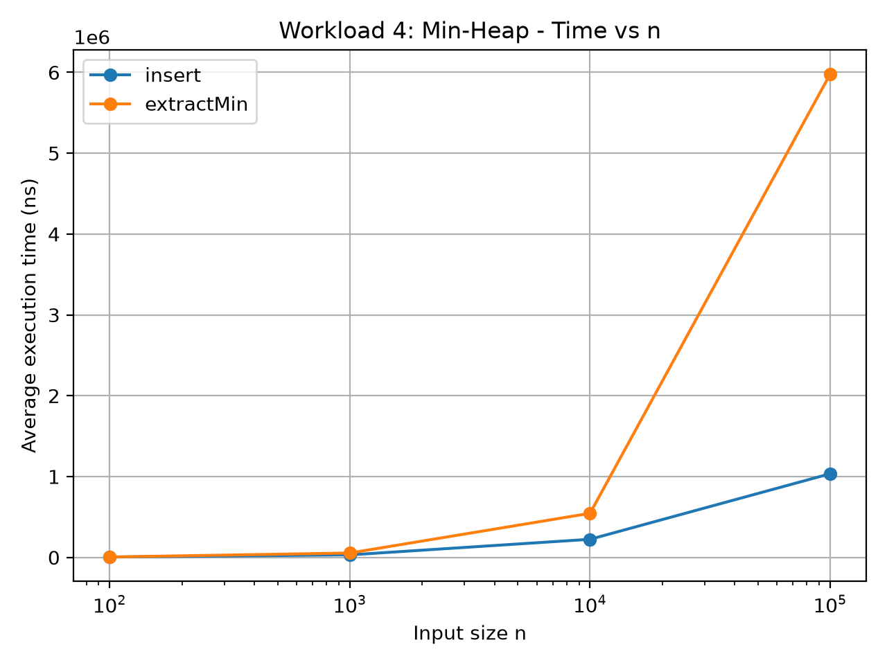
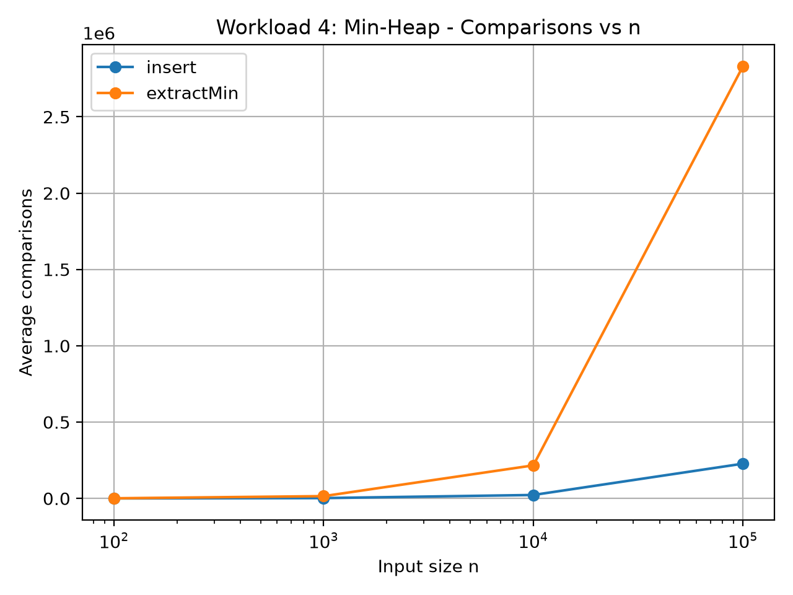

# Assignment 2 — Algorithmic Analysis, Correctness and Performance Trade-offs

## 1. Overview

The purpose of this assignment is to implement and analyze three data structures:

- Dynamic Array
- Linked List
- Min-Heap

The main goal is not only to implement these structures, but also to compare their theoretical and practical performance.

The project includes:

- manual implementation of the three data structures;
- asymptotic complexity analysis;
- correctness proofs using loop invariants;
- correctness testing;
- four experimental workloads;
- execution-time measurements;
- comparison, access, and movement counting;
- benchmark tables;
- performance plots.

Java standard collections are used only in the testing phase to validate the correctness of the custom implementations.


## 2. Project Structure

```text
Assignment2/
├── src/
│   ├── DynamicArray.java
│   ├── LinkedList.java
│   ├── MinHeap.java
│   ├── Tests.java
│   └── Benchmark.java
│
├── results/
│   ├── tables/
│   │   ├── workload1_random_access.csv
│   │   ├── workload2_search.csv
│   │   ├── workload3_updates.csv
│   │   └── workload4_heap.csv
│   │
│   └── plots/
│       ├── workload1_accesses.png
│       ├── workload1_time.png
│       ├── workload2_comparisons.png
│       ├── workload2_time.png
│       ├── workload3_operations.png
│       ├── workload3_time.png
│       ├── workload4_comparisons.png
│       └── workload4_time.png
│
├── plot_results.py
└── README.md
```


# 3. Implemented Data Structures

## 3.1 Dynamic Array

The Dynamic Array stores elements in a contiguous integer array.

It supports:

- `add(x)`
- `add(index, x)`
- `remove(index)`
- `get(index)`
- `contains(x)`

When the internal array becomes full, its capacity is doubled and the existing elements are copied into a new array.


## 3.2 Linked List

The Linked List is implemented using nodes.

Each node stores:

- an integer value;
- a reference to the next node.

The structure also stores references to the head and tail.

It supports:

- `add(x)`
- `add(index, x)`
- `remove(index)`
- `get(index)`
- `contains(x)`


## 3.3 Min-Heap

The Min-Heap is implemented using an array.

For every node, the following heap property must hold:

```text
parent <= child
```

The structure supports:

- `insert(x)`
- `peekMin()`
- `extractMin()`

`siftUp()` is used after insertion and `siftDown()` is used after extraction.


# 4. Complexity Analysis

## 4.1 Dynamic Array

| Operation | Best Case | Average Case | Worst Case | Auxiliary Space |
|---|---|---|---|---|
| `add(x)` | Θ(1) | Θ(1) amortized | Θ(n) | Θ(1), temporary Θ(n) during resize |
| `add(index, x)` | Θ(1) | Θ(n) | Θ(n) | Θ(1), temporary Θ(n) during resize |
| `remove(index)` | Θ(1) | Θ(n) | Θ(n) | Θ(1) |
| `get(index)` | Θ(1) | Θ(1) | Θ(1) | Θ(1) |
| `contains(x)` | Θ(1) | Θ(n) | Θ(n) | Θ(1) |

`get(index)` is constant-time because an array can directly access an element using its index.

Insertion and removal may require many elements to be shifted.

Appending an element is normally constant-time, but occasionally a resize operation requires all current elements to be copied.


## 4.2 Linked List

| Operation | Best Case | Average Case | Worst Case | Auxiliary Space |
|---|---|---|---|---|
| `add(x)` | Θ(1) | Θ(1) | Θ(1) | Θ(1) |
| `add(index, x)` | Θ(1) | Θ(n) | Θ(n) | Θ(1) |
| `remove(index)` | Θ(1) | Θ(n) | Θ(n) | Θ(1) |
| `get(index)` | Θ(1) | Θ(n) | Θ(n) | Θ(1) |
| `contains(x)` | Θ(1) | Θ(n) | Θ(n) | Θ(1) |

Adding at the end is constant-time because the implementation keeps a tail reference.

Insertion and removal at the beginning are also constant-time.

However, accessing a general index requires traversal from the head, which gives linear complexity.


## 4.3 Min-Heap

| Operation | Best Case | Average Case | Worst Case | Auxiliary Space |
|---|---|---|---|---|
| `insert(x)` | Θ(1) | O(log n) | O(log n) | Θ(1), temporary Θ(n) during resize |
| `peekMin()` | Θ(1) | Θ(1) | Θ(1) | Θ(1) |
| `extractMin()` | Θ(1) | Θ(log n) | Θ(log n) | Θ(1) |

The minimum value is always stored at the root, so `peekMin()` is constant-time.

Insertion can move a value upward through the heap.

Extraction may move the root replacement downward through the heap.

The height of a binary heap is logarithmic, which explains the `O(log n)` bound.


# 5. Algorithmic Correctness

Two non-trivial operations were selected for correctness proofs:

1. Dynamic Array insertion at a specific index.
2. Min-Heap insertion.


## 5.1 Dynamic Array Insertion Loop Invariant

Consider the shifting loop used in:

```text
add(index, value)
```

### Loop Invariant

At the beginning of each iteration, all original elements to the right of the current position that have already been processed are located exactly one position to the right of their original positions, and their original order is preserved.

### Initialization

Before the first iteration, no elements have been shifted.

Therefore, the processed part is empty and the invariant is true.

### Maintenance

During each iteration:

```text
data[i] = data[i - 1];
```

one additional element is moved one position to the right.

Previously shifted elements are not changed, so their correct positions and order are preserved.

Therefore, the invariant remains true after the iteration.

### Termination

The loop terminates when the insertion index is reached.

At this moment, every original element from the insertion position to the end has been shifted one position to the right.

The requested position is now free.

The new element is stored at that index.

Therefore, the final Dynamic Array contains the new element at the correct location while preserving all original elements in their original relative order.


## 5.2 Min-Heap Insertion Loop Invariant

After a new element is added to the end of the heap, `siftUp()` restores the heap property.

### Loop Invariant

Before each iteration of the `siftUp()` loop, the heap property is valid everywhere except possibly between the current node and its parent.

### Initialization

Before insertion, the heap is valid.

The new element is added as the last leaf.

No existing relationships are changed.

Therefore, the only possible violation is between the new element and its parent.

The invariant is true before the first iteration.

### Maintenance

If:

```text
parent <= current element
```

the heap property is already satisfied.

Otherwise, the parent and current node are swapped.

After the swap, the lower part of the heap remains valid and the only possible violation moves one level upward.

Therefore, the invariant is maintained.

### Termination

The loop stops when either:

- the current node reaches the root; or
- its parent is smaller than or equal to it.

At this point no parent-child violation remains.

Therefore, the complete Min-Heap satisfies the required heap property.


# 6. Experimental Setup

The following input sizes were used:

```text
n = 100
n = 1,000
n = 10,000
n = 100,000
```

Each experiment was executed five times.

The average execution time of the five runs was recorded.

Timing was performed using:

```text
System.nanoTime()
```

A fixed random seed was used:

```text
new Random(42)
```

This makes the generated benchmark data reproducible.

Input generation was performed before the measured section.

Printing was also excluded from the measured section.

A JVM warm-up was performed before the experiments to reduce some effects of JIT compilation.


## Operations per Workload

### Workload 1

```text
10,000 random get(index) operations
```

### Workload 2

```text
1,000 contains(value) operations
```

### Workload 3

```text
up to 1,000 insertion/removal operations
```

For small structures, the number of removals was limited to the number of valid removable elements so that invalid indexes were not used.

### Workload 4

For a heap of size `n`:

```text
n insertions
n extractMin operations
```


# 7. Experimental Results

The full generated benchmark tables are available in:

```text
results/tables/
```

The plots are available in:

```text
results/plots/
```


## 7.1 Workload 1 — Random Access

Structures:

- Dynamic Array
- Linked List

10,000 random indices were generated for each value of `n`.


### Access Results

| n | Dynamic Array Accesses | Linked List Accesses |
|---:|---:|---:|
| 100 | 10,000 | 511,508 |
| 1,000 | 10,000 | 5,015,208 |
| 10,000 | 10,000 | 50,139,208 |
| 100,000 | 10,000 | 502,499,208 |

The Dynamic Array required exactly one element access for every `get(index)` operation.

Because 10,000 calls were made, it always performed 10,000 accesses.

The Linked List required more node accesses as `n` increased because each random access requires traversal from the head.

For `n = 100,000`, more than 502 million node accesses were required.


### Theoretical Comparison

```text
DynamicArray.get(index) → Θ(1)
LinkedList.get(index)   → Θ(n)
```

The measured access counts strongly agree with the theoretical analysis.


### Plots






## 7.2 Workload 2 — Search

Both structures perform linear search in `contains(value)`.

The corrected benchmark generated independent search values using the same reproducible random sequence.


### Results

| n | Dynamic Array Avg Time (ns) | Linked List Avg Time (ns) | Comparisons |
|---:|---:|---:|---:|
| 100 | 202,650.00 | 209,033.40 | 94,384 |
| 1,000 | 476,250.00 | 1,401,841.80 | 952,021 |
| 10,000 | 2,311,166.80 | 13,555,833.20 | 9,485,303 |
| 100,000 | 25,008,491.80 | 137,655,775.00 | 95,047,696 |

The comparison count increases approximately linearly as `n` increases.

Both structures perform the same number of value comparisons because both use linear search.

However, the Linked List takes more execution time, especially for large values of `n`.


### Theoretical Comparison

```text
DynamicArray.contains(x) → Θ(n)
LinkedList.contains(x)   → Θ(n)
```

The results agree with the theoretical complexity.

Even though both structures have the same asymptotic complexity, their real execution time differs because they have different memory layouts and access patterns.


### Plots






## 7.3 Workload 3 — Insertion and Removal

Insertion and removal were tested at:

```text
index = 0
```

and:

```text
index = n / 2
```


### Beginning Operations

For large input sizes, Dynamic Array beginning operations caused a very large number of element movements.

For `n = 100,000`, approximately:

```text
Dynamic Array insertion at beginning:
201 million movements/accesses

Dynamic Array removal at beginning:
199 million movements/accesses
```

In comparison, Linked List insertion at the beginning required no traversal.

Linked List removal at the beginning required only constant work per operation.


### Middle Operations

For middle operations, both structures show linear behavior.

Dynamic Array must shift a large section of its elements.

Linked List must traverse approximately half of its nodes before reaching the requested location.

For example, for `n = 100,000`, 1,000 Linked List middle insertions required approximately:

```text
50,000,000 node accesses
```


### Theoretical Comparison

```text
Dynamic Array insert beginning → Θ(n)
Dynamic Array remove beginning → Θ(n)

Linked List insert beginning   → Θ(1)
Linked List remove beginning   → Θ(1)

Dynamic Array insert middle    → Θ(n)
Dynamic Array remove middle    → Θ(n)

Linked List insert middle      → Θ(n)
Linked List remove middle      → Θ(n)
```

The experimental operation counts agree with the expected theoretical behavior.


### Plots






## 7.4 Workload 4 — Priority Processing

The Min-Heap was tested by:

1. inserting `n` random integers;
2. extracting the minimum element `n` times.

The extracted values were verified to be in non-decreasing order.


### Comparison Results

| n | Insert Comparisons | ExtractMin Comparisons |
|---:|---:|---:|
| 100 | 197 | 845 |
| 1,000 | 2,241 | 14,978 |
| 10,000 | 22,602 | 216,531 |
| 100,000 | 227,662 | 2,831,463 |

The number of comparisons increases as the heap grows.

`extractMin()` performs more comparisons because after removing the root, `siftDown()` may travel through several levels of the heap.


### Complexity

For a single operation:

```text
insert(x)     → O(log n)
peekMin()     → Θ(1)
extractMin()  → O(log n)
```

Because the workload performs `n` insertions and `n` extractions, the total theoretical upper bound for each complete phase is:

```text
n insertions    → O(n log n)
n extractions   → O(n log n)
```


### Plots






# 8. Discussion

## 8.1 Effect of Increasing n

Increasing `n` affects the workloads differently depending on the structure and operation.

Dynamic Array random access remains constant because array indexing does not require traversal.

Linked List random access becomes increasingly expensive because more nodes may need to be visited.

Linear search becomes more expensive for both structures as the number of elements grows.

Insertion and removal near the beginning are expensive for Dynamic Array because many elements must be shifted.

Linked List performs beginning insertion and removal efficiently because only references are changed.

Heap operations increase much more slowly because the height of the heap grows logarithmically.


## 8.2 Agreement with Theoretical Complexity

Most measured operation counts closely agree with theoretical complexity.

Examples include:

- constant Dynamic Array random access;
- linear Linked List random access;
- linear search comparisons;
- linear Dynamic Array element shifting;
- constant Linked List beginning operations;
- logarithmic heap adjustment per operation.


## 8.3 Differences Between Theory and Measured Time

Real execution time does not always increase perfectly according to the mathematical complexity.

Asymptotic notation describes the growth rate for large input sizes and ignores constant factors.

Measured execution time can also be influenced by:

- JVM JIT compilation;
- CPU cache;
- memory layout;
- garbage collection;
- branch prediction;
- operating system scheduling;
- background processes;
- measurement noise.

For this reason, operation and comparison counts sometimes show theoretical growth more clearly than raw execution time.


## 8.4 Same Big-O, Different Running Time

Two algorithms can have the same Big-O complexity but still have different execution times.

For example:

```text
DynamicArray.contains(x) → Θ(n)
LinkedList.contains(x)   → Θ(n)
```

However, the Dynamic Array was faster in the search benchmark.

One reason is memory organization.

Dynamic Array elements are stored contiguously.

Linked List nodes are connected by references and may be located in different memory locations.

Therefore, the cost of one logical operation is not necessarily the same between two implementations.


## 8.5 Constant Factors

Big-O notation ignores constant factors.

In practice, additional comparisons, reference traversal, memory allocation, method calls, and cache behavior affect real performance.

These implementation details explain why two algorithms with the same asymptotic complexity can produce different measured times.


# 9. Design Recommendations

## Dynamic Array

Dynamic Array is suitable when:

- frequent random access is required;
- `get(index)` is common;
- most additions occur near the end;
- memory locality is important.

It is less suitable when frequent insertion or removal is required near the beginning.


## Linked List

Linked List is useful when:

- frequent insertion occurs at the beginning;
- frequent removal occurs at the beginning;
- random index access is not important.

It is less suitable for workloads containing many `get(index)` operations.


## Min-Heap

Min-Heap is appropriate for priority-based processing.

It is useful when an application repeatedly needs to:

- find the minimum element;
- remove the minimum element;
- insert new priority values.

The root provides constant-time access to the minimum value while insertion and extraction require only logarithmic heap adjustment.


## Workload-Based Selection

There is no single data structure that is optimal for every workload.

The correct choice depends on which operations are performed most frequently.

A Dynamic Array is more appropriate for random access.

A Linked List can be more appropriate for beginning insertion and removal.

A Min-Heap is more appropriate when priority processing is required.


# 10. Testing and Correctness Validation

The implementations were tested with:

- empty structures;
- one element;
- multiple elements;
- duplicate values;
- boundary indices;
- invalid indices;
- large inputs.

The custom Dynamic Array was compared with Java's `ArrayList`.

The custom Linked List was compared with Java's `LinkedList`.

The custom Min-Heap was compared with Java's `PriorityQueue`.

For the Min-Heap, the tests additionally verified that:

- the heap property is maintained after insertion;
- the heap property is maintained after extraction;
- `extractMin()` produces values in non-decreasing order.

The final test result was:

```text
ALL TESTS PASSED
Process finished with exit code 0
```


# 11. Conclusion

This assignment demonstrated the relationship between theoretical algorithm analysis and actual measured performance.

The Dynamic Array provides very efficient random access because elements can be accessed directly by index.

However, insertion and removal near the beginning require many element shifts.

The Linked List supports efficient insertion and removal at the beginning, but random access is expensive because nodes must be traversed sequentially.

The Min-Heap provides efficient priority processing by maintaining the minimum value at the root and using logarithmic heap adjustments.

The experiments generally agreed with theoretical complexity.

At the same time, the results also showed that Big-O complexity alone does not completely determine real execution time.

Implementation details, memory organization, the JVM, and hardware behavior also affect practical performance.